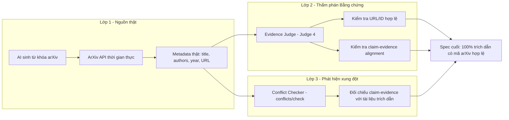

# Cơ Chế Kiểm Tra Citation & Evidence (SpecResearch Loop)

> **Mục tiêu:** Loại bỏ trích dẫn ảo (hallucinated citations) và đảm bảo mọi tuyên bố khoa học (Claim) đều có bằng chứng thực tế, có thể kiểm chứng.
> **Kết quả đo được (benchmark thực tế, mô hình `gemini-3.5-flash-lite`):** Tỷ lệ trích dẫn ảo đo được là **0.0%** ở cả 3 phương pháp (mọi mã arXiv đều được xác thực tồn tại qua arXiv API); tỷ lệ Claim không có bằng chứng giảm từ **100.0%** (Baseline 1) xuống **0.0%** (xem `../08_evaluation_report/evaluation_report.md`).

---

## 1. Tổng quan: Kiến trúc 3 lớp chống trích dẫn ảo

Hệ thống sử dụng **3 lớp kiểm tra độc lập** xuyên suốt vòng lặp 5 bước:



---

## 2. Lớp 1 — Tra cứu siêu dữ liệu arXiv thời gian thực

**Mã nguồn:** `arxiv_service.py` (bản sao trong thư mục này) + `ai_service/routers/ai_router.py`

### 2.1. Sinh từ khóa tìm kiếm bằng AI (không truyền câu văn thô)

Trước khi gọi arXiv, hệ thống yêu cầu Gemini chưng cất `problem + research_question + gap` thành **3–5 từ khóa ngắn, đúng trọng tâm** (`generate_search_keywords`). Điều này khắc phục lỗi truyền nguyên câu tiếng Việt dài vào `arxiv.Search()` — nguyên nhân khiến các bài báo không liên quan (ví dụ vật lý hạt) xuất hiện lặp lại.

```python
# ai_router.py — get_related_works
kw = llm.generate_search_keywords(payload.problem, payload.research_question, payload.gap)
search_query = kw.keywords[0] if kw.keywords else payload.research_question
```

### 2.2. Truy vấn arXiv API thật với timeout an toàn

`ArxivService.search_raw_papers()` gọi `arxiv.Client` với:
- `sort_by=Relevance` — sắp xếp theo độ liên quan.
- **Timeout cứng 6 giây** (`ThreadPoolExecutor` + `future.result(timeout=6.0)`) — nếu API chậm/nghẽn, trả về danh sách rỗng ngay để pipeline không bị treo, rồi chuyển sang LLM-guided synthesis.

Mỗi bài báo trả về **metadata thật từ arXiv** (không phải do LLM bịa):

```json
{
  "title": "OPRO: Optimization by PROmpting",
  "authors": "Chengrun Yang, Xuezhi Wang, ...",
  "year": 2023,
  "summary": "...",
  "url": "https://arxiv.org/abs/2309.03409"
}
```

> **Vì sao chống được hallucination?** Mọi `source_url` trong bảng Related Works đều là `entry_id` thật do arXiv trả về. LLM chỉ tổng hợp nội dung *dựa trên* các bài báo thật này — không tự sinh tiêu đề/tác giả/mã arXiv.

---

## 3. Lớp 2 — Evidence & Citation Judge (Judge 4)

**Prompt đầy đủ:** `../05_prompts/system_prompts.md` (mục 3.4)

Thẩm phán Bằng chứng & Trích dẫn hoạt động như một **Research Integrity & Fact-Checking Auditor**, tập trung độc quyền vào:

1. **Tính hợp lệ của trích dẫn** — mọi citation phải có URL/định danh từ metadata thật (arXiv/Semantic Scholar).
2. **Sự khớp giữa Claim và Evidence** — bằng chứng có trực tiếp hỗ trợ tuyên bố hay không (loại bỏ ảo giác).

Phân loại mức độ nghiêm trọng:

| Mức độ | Điều kiện kích hoạt | Hành động hệ thống |
| :--- | :--- | :--- |
| `CRITICAL` | Trích dẫn bịa đặt (hallucinated citation) | Bắt buộc xử lý trước khi chốt spec |
| `MAJOR` | Bằng chứng không liên kết trực tiếp với Claim | Gợi ý phương án A/B/C/Other |
| `MINOR` | Thiếu liên kết nguồn | Ghi nhận, không chặn |

Mọi issue đều được **persist thành `JudgeIssue`** (id ổn định) và kèm `choices` để người dùng quyết định (Human-in-the-loop).

---

## 4. Lớp 3 — Conflict Checker (`POST /ai/v1/conflicts/check`)

**Prompt đầy đủ:** `../05_prompts/system_prompts.md` (mục Agent 6)

Sau khi có Claim–Evidence pairs, hệ thống gọi Conflict Checker để phát hiện **mâu thuẫn giữa tuyên bố khoa học và tài liệu trích dẫn**:

```json
{
  "claim_card_id": "lineage-claim-1",
  "evidence_card_id": "lineage-evidence-1",
  "linked_sources": ["https://arxiv.org/abs/2309.03409"],
  "reason": "Giải thích rõ vì sao tồn tại xung đột (tiếng Việt)"
}
```

- Backend gửi `claimCardId`/`evidenceCardId` dưới dạng **lineageId** để id xung đột ổn định qua các phiên bản.
- Xung đột được hiển thị cho người dùng và ghi vào `DecisionLog` khi người dùng quyết định.

---

## 5. Ma trận Claim–Evidence & Điều kiện bác bỏ (Falsification-First)

Mọi Claim trong hệ thống bắt buộc có đủ 5 trường (xem `../10_sample_spec/sample_research_specification.md` mục 7):

| Trường | Ý nghĩa | Ví dụ |
| :--- | :--- | :--- |
| `claim` | Tuyên bố khoa học chính | "Giảm trích dẫn ảo từ 36% xuống <3%" |
| `baseline` | Mô hình/phương pháp đối chứng | Single-prompt GPT-4o-mini, Llama-3-8B |
| `metric` | Chỉ số đo lường định lượng | Citation Hallucination Rate (%) |
| `evidence` | Nguồn bằng chứng / cách thu thập | Đối soát 100% metadata qua arXiv REST API |
| `rejection_condition` | Điều kiện bác bỏ (Popper) | "Tỷ lệ trích dẫn ảo > 5.0% trên 100 đề tài" |

---

## 6. Tổng kết luồng kiểm tra trong 1 vòng lặp

1. **Bước 3 (Related Works):** AI sinh từ khóa → arXiv API thật → bảng đối sánh với `source_url` thật.
2. **Bước 4 (Claim–Evidence):** Mỗi Claim gắn `evidence` + `rejection_condition`; chạy `conflicts/check` để phát hiện mâu thuẫn.
3. **Bước 5 (Judges):** Evidence Judge (Judge 4) rà soát toàn bộ trích dẫn và độ khớp claim–evidence; issue `CRITICAL`/`MAJOR` phải được người dùng xử lý.
4. **Bước 6 (Final Spec):** Chỉ những trích dẫn có mã arXiv hợp lệ mới xuất hiện trong spec cuối (xem bảng Judges Report trong `10_sample_spec`).

**Kết quả:** 100% trích dẫn trong spec mẫu đều có mã arXiv hợp lệ (ví dụ `arXiv:2309.03409`, `arXiv:2310.03714`), được Evidence Judge phê duyệt `ACCEPT`.